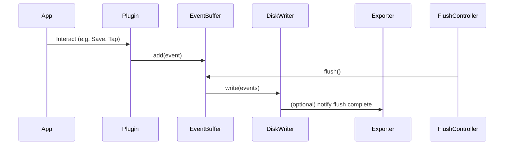

# Relay Event Buffering System — Engineering Design

**Author**: Relay Core Team  
**Status**: Draft  
**Last Updated**: March 2025

---

## 📌 Overview

Relay's event buffering system enables high-throughput, low-latency capture of observability signals (e.g. spans, metrics, interactions) without compromising app performance or reliability.

This design outlines an in-memory ring buffer backed by a flush controller and disk writer. The system is optimized for mobile environments with constraints around memory, power, and responsiveness.

---

## 🎯 Goals

- **Minimize runtime overhead**: Capture thousands of events per minute with negligible CPU/memory impact.
- **Preserve data integrity**: Ensure events are reliably flushed to disk or exported.
- **Support extensibility**: Compatible with sampling agents, crash recovery, and multiple exporters.
- **Fail safe**: Never block the main thread or cause observable app slowdowns.

---

## 🧱 Components

### 1. `RingBuffer<T>`

A fixed-capacity, circular buffer that supports high-frequency appends.

- **Thread-safe** via internal background queue
- Constant memory footprint: `O(N)` where N = capacity
- Overwrites oldest data when full (FIFO semantics)
- Supports atomic snapshot and reset for flushing

> Used internally by `RelayEventBuffer` to store events.

---

### 2. `RelayEventBuffer`

Acts as the interface for all plugins and instrumentation layers to submit telemetry.

- Maintains an internal `RingBuffer<RelayEvent>`
- Asynchronous `add(_:)` and `flush()` methods
- Background-safe: flushes triggered by timers or app lifecycle events
- Flush returns a snapshot, then clears the buffer

---

### 3. `RelayDiskWriter`

Responsible for serializing flushed events to disk.

- Pluggable storage format (JSONL, binary, protobuf)
- Write operations run on a background queue
- Output directory is rotated and managed for export
- Future support: crash-safe persistence, batching, encryption

---

### 4. `RelayFlushController`

Coordinates when and how flushes are triggered.

- Periodic timer-based flushing (e.g. every 5s)
- App lifecycle hooks (e.g. `UIApplication.willResignActiveNotification`)
- Future support: memory pressure hooks, flush-on-export-demand
- One controller per active buffer

---

## 🔄 Data Flow



---

## 🚀 Performance Expectations

| Operation         | Expected Time |
|------------------|----------------|
| `add(event)`     | < 1 ms         |
| `flush()`        | ~5-10 ms (I/O bound) |
| Memory usage     | ~64KB @ 1K events (avg) |
| Disk throughput  | Batched writes only |

> Profiling to be benchmarked using XCTest, Instruments, and synthetic workloads.

---

## 🧩 Extensibility Roadmap

- Smart sampling policies (adaptive, weighted, remote-configurable)
- Flush pipeline that streams directly to exporters
- Low memory mode handling (auto-flush, drop policy)
- Crash recovery and startup replay
- Exporter multiplexing (Datadog, OTel, custom)

---

## 🧪 Testing Strategy

- Unit tests: enqueue, flush, overwrite, lifecycle triggers
- Integration tests: flush-to-disk + exporter flow
- Performance benchmarks (1000+ events/sec)
- Fault injection: simulate crash during flush

---

## 📁 File Structure

```
Sources/
└── RelayCore/
    └── Internal/
        ├── RingBuffer.swift
        ├── RelayEventBuffer.swift
        ├── RelayDiskWriter.swift
        ├── RelayFlushController.swift
```

---

## ✅ Summary

This buffering system enables Relay to reliably collect high-fidelity telemetry in demanding mobile environments. It’s efficient, extensible, and designed with safety-first principles — ensuring minimal impact on end-user performance while enabling rich observability.

